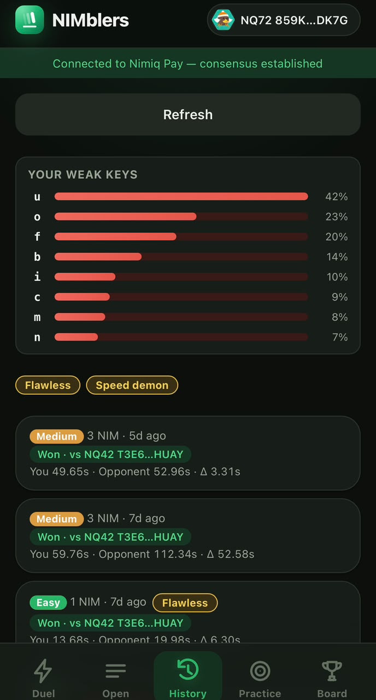
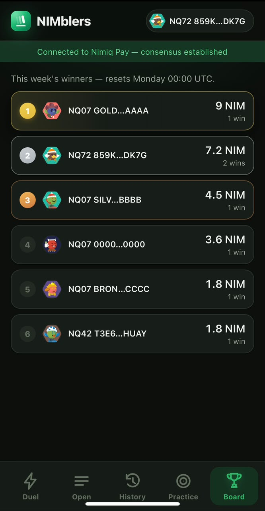
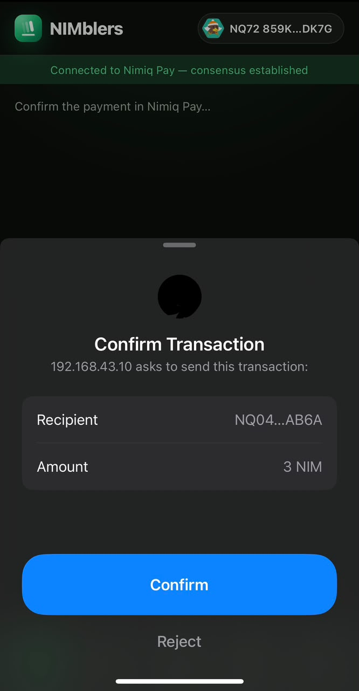
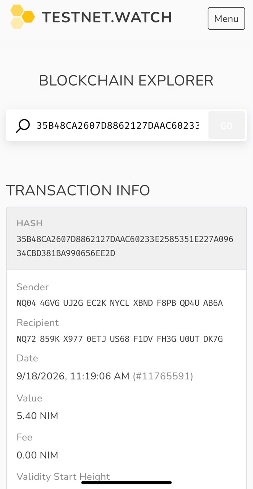

# ⌨️ NIMblers

**Stake NIM. Type fast. Winner takes the pot.**

An async 1v1 speed-typing wager, built as a Nimiq Pay Mini App.


---

## Screenshots


|                                                                            |                                                                               |                                                                                          |
| -------------------------------------------------------------------------- | ----------------------------------------------------------------------------- | ---------------------------------------------------------------------------------------- |
|                    |  |  |
| Browse and challenge open stakes                                           | A freshly generated paragraph, timed server-side                              | Both times revealed only once the duel is decided                                        |
|  |      |     |
| Every settled duel, either side of it                                      | Ranked by NIM actually won, resets weekly                                     | The stake itself always goes through Nimiq Pay's own dialog                              |


A settlement's payout, independently verified on-chain  
  
  


The transaction hash on the result screen links straight to
[test.nimiq.watch](https://test.nimiq.watch) — every payout is checkable
against the chain itself, not just displayed by the app that sent it.


## Contents

- [What it is](#what-it-is)
- [Why Nimiq](#why-nimiq)
- [How a duel works](#how-a-duel-works)
- [What makes it hard to cheat](#what-makes-it-hard-to-cheat)
- [Under the hood](#under-the-hood)
- [Try it](#try-it)
- [Project layout](#project-layout)
- [House wallet setup (testnet)](#house-wallet-setup-testnet)


## What it is

NIMblers is a head-to-head typing game with real stakes. You stake NIM, type
a paragraph as fast and accurately as you can, and get matched against someone
else's hidden time. Whoever's faster — measured by the server, not the client —
wins the pot.

No lobby to sit in, no opponent to wait for. Player A stakes and types; Player B finds the open stake later and takes the bet. The duel is async by design — it fits inside the thirty seconds someone has between two other things.

There's also a free practice mode with the same three tiers — Easy, Medium,
Hard — for warming up before you put NIM on the line, with your personal best
per tier tracked locally so there's something to chase even solo. Practicing
never types today's live duel paragraph for any tier, so warming up can't
leak the answer.

**At a glance:**

- Real NIM stakes, three difficulty tiers, server-refereed timing — never the client's word for it
- A fresh paragraph generated per duel, not picked from a fixed pool — nothing to memorize in advance, not even by the person who created it
- Public open-duels dashboard, or a private link for a specific opponent
- Optional double trial: lose the first attempt, restake double for one final try
- Full duel history (wins, losses, both times, the delta) and a weekly leaderboard ranked by NIM actually won
- Free practice mode with a locally tracked personal best per tier


## Why Nimiq

Nimiq settles in seconds and its Mini Apps run *inside* the wallet — no install,
no separate account, no bridging funds around. For a game that's decided in
under a minute, that's the whole pitch: connect, stake, type, know if you won,
all without leaving the app you already have open.

## How a duel works

1. **Pick a level, then stake.** Easy is 1 NIM, Medium is 3, Hard is 5 — each
  tier gets a paragraph generated fresh from word banks at reveal time
   (`server/paragraphs/generator.ts`), tuned harder by longer words and more
   punctuation, not just a bigger number. Nobody — not even the creator —
   can know the text before staking: it doesn't exist yet. The paragraph is
   revealed only after the stake is independently confirmed on-chain, for
   that exact tier's amount — never because a client claims it happened.
   There's no "changed my mind" undo:
   closing the tab before finishing forfeits the stake rather than refunding
   it, which is what keeps stake-then-abandon from being a free way to grief
   the house wallet. A fully submitted entry that nobody ever challenges
   *does* get refunded automatically after 24 hours, and a challenger who
   locks an entry and then vanishes loses their claim on it the same way —
   the lock releases so someone else can take the bet, but their own stake
   isn't returned either, for the same anti-griefing reason.
   Every entry is public or private — A's choice, made before staking. A
   public entry lands on the open-duels dashboard for anyone to browse and
   take. A private one skips the dashboard entirely; instead A gets back a
   link that carries the entry's id — paste it into WhatsApp, DM it,
   whatever. Tapping it opens Nimiq Pay, and the mini app loads straight
   into that one duel instead of the browse list. Challenging still goes
   through the exact same on-chain-verified stake and server-refereed race
   either way — visibility only changes whether the entry is *discoverable*,
   never how it's played or settled.
2. **Type blind.** The client streams every keystroke to the server as it
  happens. The server — never the browser — computes the final time. A's time
   stays hidden from everyone, including A, until the duel resolves.
3. **Someone takes the bet.** Player B browses open stakes (opponent, level,
  amount, age — never a time) and matches one at that exact stake, or
   arrives straight at a private one through its link. That locks the entry
   — the lock is what stops two challengers racing for the same stake — and
   starts a timer for B's own run. If B never finishes, the lock expires and
   the entry reopens for someone else; A's stake is never at risk from a
   challenger who wanders off.
4. **Winner takes the pot.** The instant B's run is recorded, the server
  compares both independently-verified times, takes a 10% rake, and pays
   the winner the rest — on-chain, automatically, no manual step. A tie
   refunds both stakes in full; nothing is raked from a refund. B's
   response carries the reveal: both times, the delta between them, and
   the transaction hash, so the outcome is checkable, not just asserted.

Every win is public: a leaderboard ranks players by total NIM actually won,
visible to anyone opening the app, wallet connected or not.

A can also opt an entry into **double trial** before staking, off by
default. If they did, and B loses the first attempt, B doesn't see A's time
yet — instead B gets a choice, right there, with zero further action ever
needed from A: take the loss, or restake double and try again. That second
attempt is final either way. Decide within a few minutes, or it settles as
a loss on its own — nobody's stake sits in limbo waiting on somebody who
walked away.

The one rule this whole project won't bend on: **the client never reports a
time.** Every duration is recomputed server-side from the raw keystroke stream,
so there's nothing to fake.

## What makes it hard to cheat

- Every keystroke is a timestamped event, not a final number the client hands
over — the server replays and re-times every run itself.
- The clock starts on the first keystroke and freezes on the exact keystroke
that completes the paragraph — never on the Submit click. You can stare at
a finished duel for ten minutes before hitting Submit and the recorded time
won't move.
- A hard WPM ceiling rejects outright — nobody legitimately types at 2000+
WPM. Below that, statistical checks watch for the tells of scripted input:
keystrokes on a suspiciously fixed timer, "randomness" that's actually
flat uniform noise instead of the peaked shape real typing rhythm has, and
missing the natural speed-up/slow-down on common letter pairs (`th` is
fast, `qp` is slow — a bot that ignores content doesn't know that).
- Those statistical checks flag runs for review instead of auto-voiding them
— they're still accepted and scored. False positives get refunded; nobody
gets silently robbed by a heuristic that guessed wrong.
- Submissions are rate-limited per address per day, independent of any of
the above.


## Under the hood

- **Frontend:** Vite + React + TypeScript, talking to Nimiq Pay through
`@nimiq/mini-app-sdk`
- **Identicons:** every address anywhere in the app — the open-duels
dashboard, a duel invite, the settlement reveal, the leaderboard, your own
connected address — renders through `@nimiq/identicons`, the same
official library Nimiq's own wallet uses. It hashes the address string
itself, so a given address always produces the exact avatar the rest of
the Nimiq ecosystem already shows for it — nothing here invents its own
avatar scheme that would look out of place next to a real Nimiq wallet.
- **API:** Node's built-in `http` module — no routing framework dependency for
the handful of routes there are so far
- **Data:** SQLite via Node's built-in `node:sqlite` — the entire data layer
ships with zero extra dependencies
- **Tests:** Node's built-in test runner — no test framework dependency either
- **Shared core:** the exact same replay logic the typing UI uses to build a
keystroke stream is what the server uses to independently re-verify it — one
implementation in `shared/`, imported by both sides, so there's no separate
"server's opinion of how typing works" to drift out of sync
- **Duel lifecycle:** a pure state machine (`server/duels/stateMachine.ts`)
with four states — `OPEN → LOCKED → SETTLED`, or `→ EXPIRED` — and no I/O
at all, so it's property-tested directly: thousands of randomized event
sequences, checked after every single step, confirm a duel can never
settle twice, never owe more than the two stakes actually in its pot, and
never end up in a terminal state with no one entitled to the money
- **No double-challenge race:** when two people try to challenge the same
entry at once, the lock is a single conditional SQL `UPDATE ... WHERE status = 'OPEN'` with nothing async before it — SQLite is single-threaded,
so the two requests literally cannot both see the entry as open. One
locks it and gets the paragraph; the other gets a clean rejection,
verified with real concurrent HTTP requests, not just sequential calls
- **Escrow:** custodial by necessity. Nimiq has no general smart contracts —
only basic, vesting, and HTLC accounts, and an HTLC's recipient is fixed at
creation — so a duel's stake can't sit in a trustless on-chain contract
waiting for a winner to be decided. A house wallet holds both stakes and
releases them once the server has resolved the duel. That trade-off is
deliberate and stated up front, not hidden in the fine print. Every
movement — a stake received, a payout, a refund — is written to one
ledger keyed by an idempotency key that's claimed atomically, so a retry
(accidental or malicious) can never send twice. `services/escrow.ts` is
the *only* module in the codebase allowed to touch that wallet.
- **House wallet transport — JSON-RPC, not a P2P light client:**
`@nimiq/core`'s v2 P2P client (`Nimiq.Client.create()`) spawns a worker
thread whose WASM internals call a browser-only `addEventListener`,
which Node's `Worker` doesn't provide — a confirmed upstream bug
([nimiq/core-rs-albatross#3417](https://github.com/nimiq/core-rs-albatross/issues/3417)),
reproduced with the exact same `Client.create()` pattern this project
used to use, under plain Node.js — not specific to any one host or
sandbox. `services/nimiqWallet.ts` works around it: transaction
*building and signing* (`PrivateKey`, `KeyPair`, `TransactionBuilder`)
run synchronously against `@nimiq/core`'s WASM module in the main
thread — no worker, unaffected by the bug — so the private key still
never leaves this process. Only the *network* calls (balance, broadcast,
transaction lookup) go over plain JSON-RPC to a node you point it at,
covered end to end by `services/nimiqWallet.test.ts` against a local
mock RPC server (real signing, real wire format, no network needed to
prove it's correct).
- **Settlement:** deciding a winner is a pure comparison — the lower of the
two server-recorded durations wins, an exact tie refunds both — reusing
the same state-machine logic the duel lifecycle is already property-tested
against, so there's no second "who won" implementation to drift out of
sync with the first. The comparison, the rake, and the payout/refund
calls all re-run identically on a retry (a dropped response, a client
resubmit), and since `payout`/`refund` are themselves idempotent per
duel, a retry re-derives the same reveal instead of moving money twice —
verified by driving the actual settlement twice in a row and asserting
only one payout row exists.
- **Expiry sweep:** a scheduled job (`npm run expiry:sweep`, meant to run on
a timer — nothing in this repo schedules it itself) refunds entries
nobody ever challenged within 24 hours, releases challenger locks whose
TTL lapsed with no submitted run, and settles an abandoned double-trial
retry as a loss once its own (much shorter) window passes. All three
decide the same way the rest of the duel lifecycle does — via the pure
Phase 10 state machine, or (for the retry case) the same
`finalizeSettlement` every other settlement path uses — so there's one
definition of "expired" or "settled" the whole codebase agrees on. Each
row is claimed with the same atomic conditional `UPDATE ... WHERE status = '...'` the challenge lock already relies on, so the sweep is
safe to run twice, overlap with itself, or retry after a crash — an
entry created 25 hours ago and swept three times in a row is refunded
exactly once. A refund that fails mid-flight reverts its claim back to
OPEN instead of stranding the stake in a status no future sweep would
ever look at again.
- **Leaderboard:** ranks players by the sum of their completed `PAYOUT`
rows — the same ledger `services/escrow.ts` already writes and already
guarantees can't double-count, so there's no separate "winnings" number
kept anywhere else to drift out of sync with what actually got paid. A
payout that's been claimed but hasn't sent yet (`tx_hash` still null)
doesn't count — an in-flight settlement hasn't won anything until it
lands. Stakes and refunds never appear here; it tracks winnings, not
activity.
- **Public/private entries and shared links:** an entry's `visibility`
(`server/db/migrations/0004_entry_visibility`) is checked in exactly one
place — `GET /api/entries`, the dashboard listing — so it only ever
controls *discoverability*. A private link resolves through
`GET /api/entries/lookup?entryId=...`, which works for a private entry
precisely because knowing its id (an unguessable random UUID) is what a
link hands you; every other route (challenge, submit, settle) already
worked from a bare entry id and needed no visibility awareness at all.
Nimiq's provider SDK has no literal claimable-link primitive to build on
— no `createCashlink`/`claimCashlink` method exists in
`@nimiq/mini-app-sdk` — so a shared duel link isn't an on-chain Cashlink
carrying value; it's a `nimiqpay://miniapp?url=...` deep link (the same
scheme this app is already opened with) whose inner URL carries a
`?duel=<entryId>` query param. Opening it loads the mini app straight
into that one duel's invite card instead of the browse list; the actual
stake still moves through the same on-chain-verified, custodial flow
every other duel uses.
- **Double trial:** settlement doesn't have to happen the instant B
submits. If B's first attempt loses and the entry opted in
(`allow_rematch`), nothing is settled and A's time isn't revealed — the
duel sits in a pending state (`duels.retry_offer_expires_at`) instead.
From there it resolves exactly one of three ways, all converging on the
same money-moving code (`finalizeSettlement`): B explicitly takes the
loss (`declineRetry`), B stakes double and takes a final attempt
(`retryStake` → `retrySubmit`, comparing against A's *original* time —
A never types again), or nobody decides and the expiry sweep settles it
as a loss once the window passes (`settleAbandonedRetry`, the same
scheduled job that already handles abandoned locks and unclaimed
entries). The pure Phase 10 state machine's `SUBMIT` event carries the
challenger's actual total stake rather than assuming it mirrors the
creator's, so `settlementObligations` accounts correctly for a pot that
grew past the original 2x — a decisive win always takes the whole pot,
a tie always refunds each side exactly what *they* put in, whether or
not a retry happened.


## Try it

```bash
npm install
npm run db:migrate
npm run db:seed
npm run server        # API on :8787
npm run dev -- --host  # frontend on :5173, proxying /api to :8787
```

Vite prints a **Network URL** (not `localhost`) — open that inside Nimiq Pay
(Mini Apps → paste the URL). Your dev machine and phone need to be on the same
Wi-Fi network. Opened in a regular browser instead, the app shows a clear
"open me inside Nimiq Pay" screen rather than crashing. Staking requires the
API server to also have a funded house wallet — see below.

```bash
npm test    # run the test suite
npm run build  # typecheck everything + production build
```


## Project layout

```
src/                React app — UI, wallet connection, typing engine
shared/             Typing + timing replay logic used by both client and server
server/
  db/               Schema, migrations, seed data
  paragraphs/       Fresh-per-duel paragraph generation + practice-pool logic
  runs/             POST /api/runs — server-side keystroke replay and validation
  duels/            Pure state machine, Player B's flow (browse, challenge, submit,
                    settle), and the expiry/refund sweep
  entries/          Player A's flow — stake, reveal, submit, create the OPEN entry
                    at a chosen difficulty and visibility (public/private)
  leaderboard/      GET /api/leaderboard — ranks players by total NIM won
services/
  escrow.ts         The one module allowed to move NIM — stake/payout/refund/balance
  nimiqWallet.ts    House wallet client — signs locally, talks JSON-RPC to a testnet node
scripts/            One-off/scheduled scripts — a live testnet escrow demo, the expiry sweep
```


## House wallet setup (testnet)

`services/escrow.ts` needs a funded testnet house wallet, and (see "House
wallet transport" above) a Nimiq testnet node to talk to over JSON-RPC:

```bash
node -e "import('@nimiq/core').then(N => console.log(N.PrivateKey.generate().toHex()))"
```

Put the result in `.env` as `ESCROW_PRIVATE_KEY` (never commit this — it's
gitignored, and it must never be a mainnet key). Then fund that address from
Nimiq Pay's testnet faucet: long-press the settings button for 10 seconds to
reveal the dev menu, switch to Testnet, and use "Get free NIM."

Then set `NIMIQ_RPC_URL` (and `NIMIQ_RPC_USERNAME`/`NIMIQ_RPC_PASSWORD` if
the node requires auth) in `.env` — see `.env.example`. Either:

- request devnet RPC access from Nimiq's team (their Discord), or
- run your own testnet node with RPC enabled.

Without this, staking/challenging/settling all fail with a clear
`NIMIQ_RPC_URL is not set` or RPC-connection error rather than hanging —
there's no light client trying (and failing) to establish P2P consensus
anymore.

```bash
npm run escrow:demo
```

runs a full live-testnet round trip against the real network: connect,
receive a stake, refund it, and prove `payout()` sent only once when called
twice with the same idempotency key. The idempotency guarantee itself
doesn't depend on any of that — it's covered by `services/escrow.test.ts`
against a fake wallet, and the RPC transport itself by
`services/nimiqWallet.test.ts` against a local mock RPC server, no network
required for either.

```bash
npm run expiry:sweep
```

runs the expiry/refund sweep once against the real house wallet —
refunding entries nobody challenged in time, releasing stale challenger
locks, and settling an abandoned double-trial retry as a loss. Nothing in
this repo schedules it; point a cron job (or your platform's
scheduled-function equivalent) at this command. It's idempotent, so an
overlapping or repeated run is safe — but the retry window defaults to
just a few minutes (`RETRY_DECISION_WINDOW_MS` in
`server/duels/service.ts`), so run this on an interval short enough that
an abandoned retry actually resolves promptly rather than sitting well
past its own deadline. Its logic is covered by
`server/duels/expiryJob.test.ts` against a fake wallet, no network
required, for the same reason as above.

## Everything currently testnet-only

No mainnet key ever touches this repo. Staking, escrow, and payouts run
exclusively against Nimiq testnet until the app is ready to ship for real.